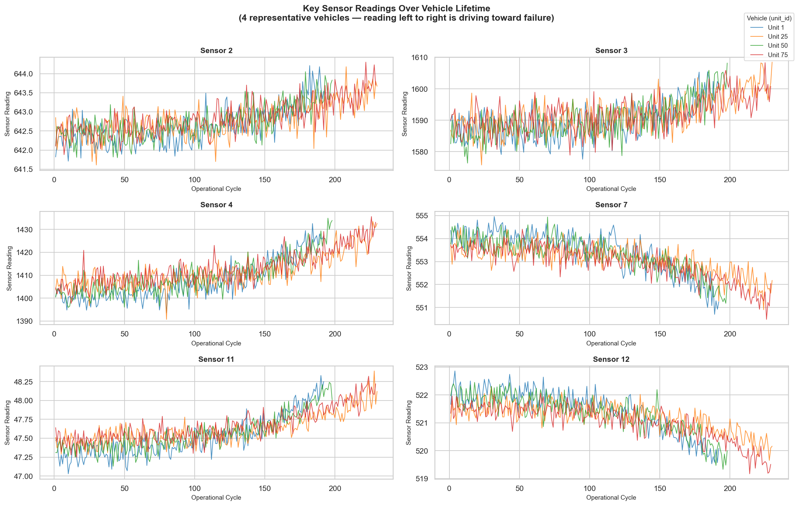
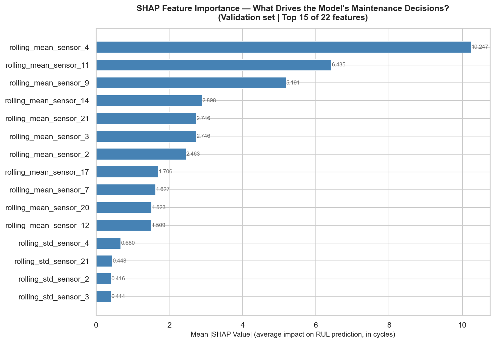
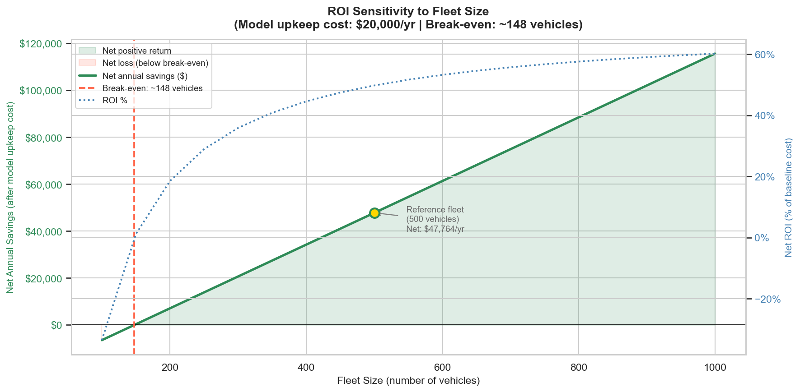

# AV Fleet Predictive Maintenance
**Sensor-based early warning system for autonomous vehicle fleet operations**

---

## Business Problem

A robotaxi fleet operations manager faces a recurring crisis: vehicles break down mid-route without warning. Each unplanned breakdown costs approximately **$2,400** in combined lost revenue and emergency repair premium — and with no early warning system, every mechanical failure is a surprise.

This project builds a **7-day early warning system** using onboard powertrain sensor telemetry. By analyzing how sensor readings trend over a vehicle's operational history, the model identifies which specific vehicles are likely to fail within the next week — so maintenance can be scheduled during a low-demand window before the vehicle ever leaves the depot.

The question the model answers every morning: **which vehicles need maintenance this week, before they fail on a route?**

---

## Results Summary

| Metric | Value |
|--------|-------|
| Model accuracy (RMSE) | 19.30 cycles *(53.5% better than baseline)* |
| Explained variance (R²) | 0.78 |
| Recall at alert threshold | 96.2% of imminent failures caught |
| Precision at alert threshold | 62.6% |
| Optimal alert window | 12 cycles ahead of failure |
| Annual net savings (500 vehicles) | $47,764 |
| ROI | 49.8% |
| Build payback period | 6.6 months |
| Break-even fleet size | 148 vehicles |
| Unplanned breakdown rate | 100% → 3.8% |

---

## Why Recall Over Accuracy

96.1% of observations in this dataset come from healthy vehicles operating normally. A naive model that always predicts "this vehicle is fine" would achieve 96.1% accuracy — and catch exactly zero impending failures.

The correct metric is **recall at a cost-weighted threshold**. A missed failure costs $2,400; a false alarm costs $400. That 6:1 cost ratio means it is worth triggering several unnecessary maintenance checks to avoid a single on-route breakdown. The alert threshold was tuned specifically to minimize total fleet cost — not to maximize accuracy — which is why the model catches 96.2% of genuine failure events even though precision is a more modest 62.6%.

---

## Technical Approach

```
Raw sensor telemetry (21 sensors, 100 vehicles)
        ↓
EDA: identify 10 constant sensors, degradation patterns
        ↓
Feature engineering: RUL labeling + rolling window statistics
        ↓
XGBoost regression: predict remaining useful life per vehicle
        ↓
Cost-optimized threshold: minimize fleet maintenance cost
        ↓
Business impact: ROI model across fleet sizes 100 → 1,000
```

**Rolling windows instead of raw readings** — a single sensor snapshot tells you where a vehicle is; a 5-cycle rolling mean and standard deviation tell you where it is heading. Trend matters more than current state for failure prediction.

**RUL cap at 125 cycles** — early in a vehicle's life, sensors look identical regardless of total lifespan. The degradation signal only emerges in the final ~125 cycles, so capping focuses the model's learning on the window where prediction is actually possible.

**Split by vehicle ID, not by row** — splitting rows randomly would let the model train on a vehicle's later cycles and "predict" its earlier ones, which is data leakage. Splitting by vehicle ID guarantees every vehicle appears entirely in either training or validation, never both.

---

## Key Visualizations


*Six key sensor channels plotted over vehicle lifetime for four representative vehicles — note the consistent directional drift as vehicles approach failure.*


*SHAP values identify which sensor trend features drive maintenance alerts — critical for operator trust and sensor investment prioritization.*


*Net annual savings as a function of fleet size, with break-even at 148 vehicles — the minimum viable deployment scale.*

---

## Project Structure

```
av-fleet-predictive-maintenance/
├── notebooks/        (4 analysis notebooks, fully executed)
├── src/              (5 importable Python modules)
├── tests/            (20 unit tests)
├── data/             (raw + processed — gitignored)
├── models/           (saved XGBoost model + scaler)
└── reports/figures/  (all visualizations)
```

| Notebook | Purpose |
|----------|---------|
| `01_eda.ipynb` | Fleet overview, sensor variance analysis, degradation patterns |
| `02_preprocessing.ipynb` | RUL labeling, RUL capping, rolling feature engineering, normalization |
| `03_modeling.ipynb` | Baseline vs. XGBoost, SHAP explainability, cost-threshold optimization |
| `04_business_impact.ipynb` | ROI model, downtime analysis, fleet-size sensitivity |

---

## Setup Instructions

```bash
git clone https://github.com/sarah-xyang/av-fleet-predictive-maintenance.git
cd av-fleet-predictive-maintenance
pip install -r requirements.txt
```

**Download the dataset** — this project uses the NASA CMAPS FD001 subset. Search for **"NASA CMAPS turbofan engine degradation"** on [Kaggle](https://www.kaggle.com/). Place the following three files in `data/raw/`:

```
data/raw/train_FD001.txt
data/raw/test_FD001.txt
data/raw/RUL_FD001.txt
```

```bash
jupyter lab
```

Run notebooks in order: `01_eda` → `02_preprocessing` → `03_modeling` → `04_business_impact`.

---

## Business Assumptions

| Assumption | Value |
|------------|-------|
| Fleet size modeled | 500 vehicles |
| Annual failure rate | 8% of fleet |
| Unplanned breakdown cost | $2,400/event |
| Scheduled maintenance cost | $400/event |
| Annual model upkeep | $20,000 |
| Vehicle revenue rate | $45/hour |

---

## Honest Limitations

- **Dataset scale** — the model was trained on 100 simulated engines under controlled conditions. Production deployment requires retraining on real fleet-scale telemetry, which will introduce operating condition variation, sensor noise, and failure modes not present in the NASA simulation.
- **Single operating condition** — FD001 is a single-condition subset; all vehicles operated under near-identical settings. Multi-condition fleets (variable routes, weather, load) require the FD002–FD004 subsets or domain adaptation techniques to avoid systematic bias.
- **Cost assumptions are illustrative** — the $2,400 breakdown cost and $400 maintenance cost are order-of-magnitude estimates used to demonstrate the ROI framework. Real deployment requires a cost audit with the fleet's finance and operations teams before business case sign-off.

---

## Portfolio Context

This is **Project 2 of 5** in a senior data science portfolio demonstrating end-to-end machine learning with business impact framing.

| Project | Description |
|---------|-------------|
| [Project 1 — Healthcare Readmission Prediction](https://github.com/sarah-xyang/healthcare-readmission-prediction) | Binary classifier predicting 30-day hospital readmission risk to reduce penalty costs under CMS value-based care |
| **Project 2 — AV Fleet Predictive Maintenance** *(this project)* | Regression + cost-threshold optimization for autonomous vehicle failure prediction |
| Project 3 — Customer Churn Prediction | Survival analysis and intervention modeling for subscription product retention |
| Project 4 — Supply Chain Demand Forecasting | Time-series forecasting with uncertainty quantification for inventory optimization |
| Project 5 — NLP Ticket Routing Classifier | Multi-class text classifier for automated customer support triage |
